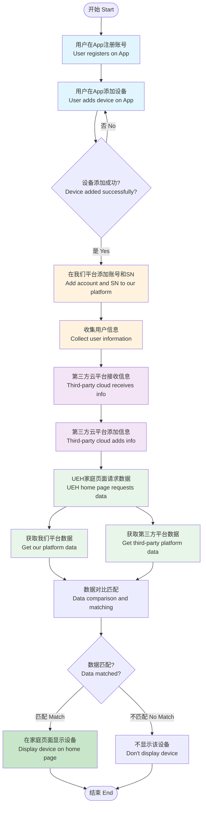
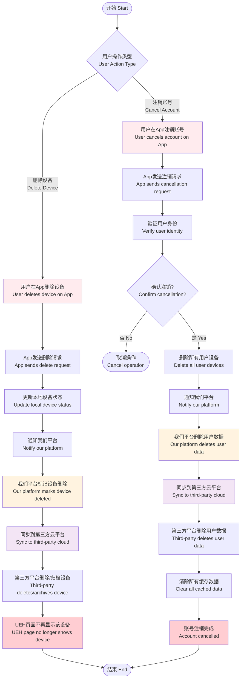
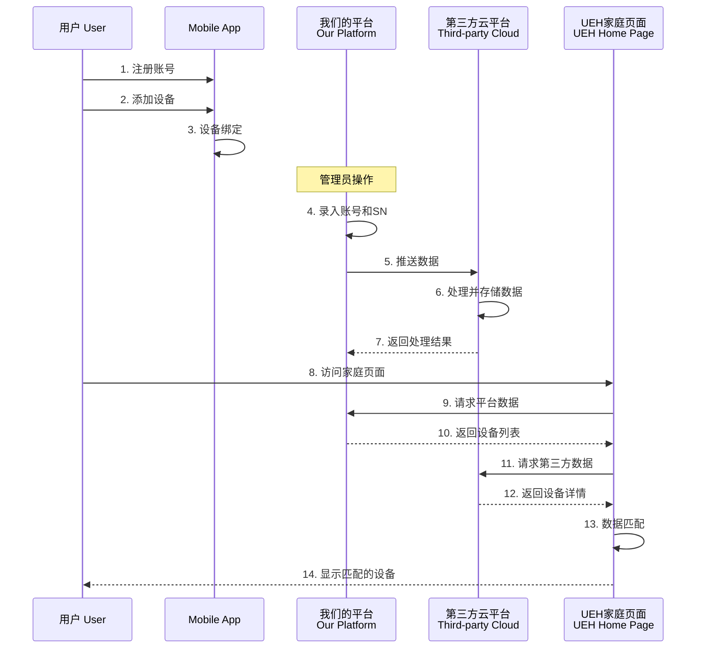
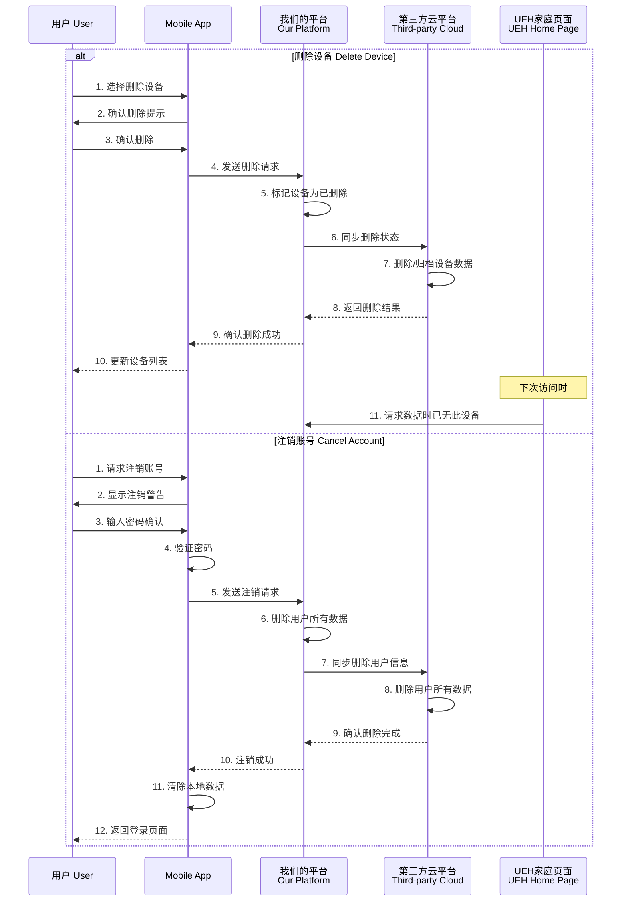
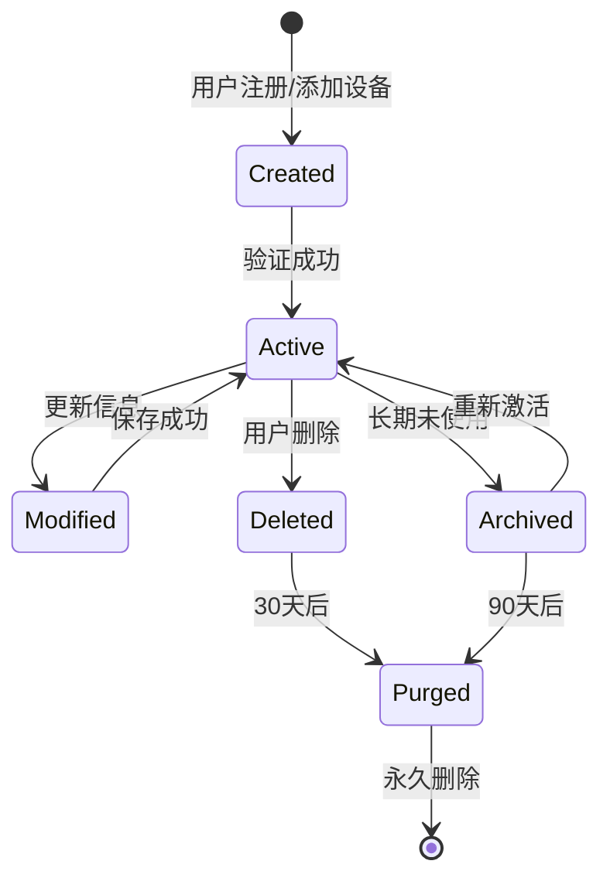
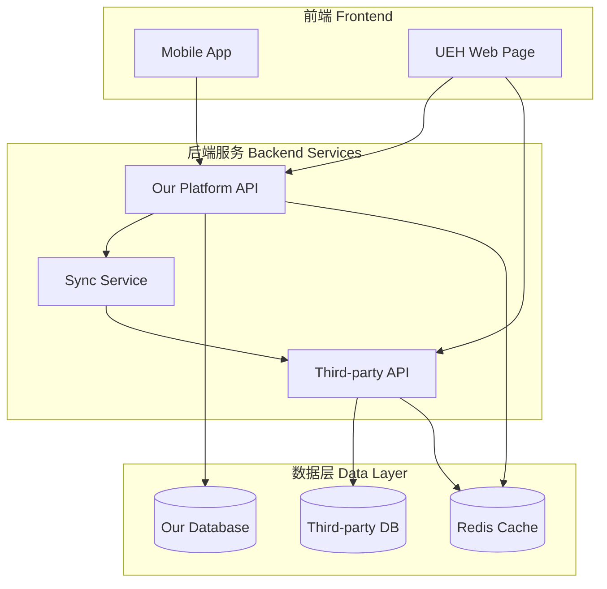

# 系统集成流程文档
## System Integration Process Documentation

---

## 概述 Overview
本文档描述了用户设备注册与第三方云平台集成的完整流程，包括从用户注册到最终在UEH家庭页面显示设备信息的全过程。

This document describes the complete process of user device registration and third-party cloud platform integration, from user registration to the final display of device information on the UEH home page.

---

## 系统架构 System Architecture

### 涉及系统 Systems Involved
1. **移动应用 (Mobile App)** - 用户端应用
2. **我们的平台 (Our Platform)** - 授权管理平台
3. **第三方云平台 (Third-party Cloud Platform)** - 外部集成平台
4. **UEH家庭页面 (UEH Home Page)** - 统一展示界面

---

## 业务流程 Business Process

### 主流程图 Main Process Flow Diagram



### 删除流程图 Deletion Process Flow Diagram



---

## 详细步骤说明 Detailed Steps

### 第一阶段：用户端操作 Phase 1: User Operations

#### 1.1 用户注册 User Registration
- **操作平台**: 移动App
- **操作内容**: 
  - 用户下载并安装App
  - 填写注册信息（用户名、密码、邮箱/手机号）
  - 完成账号验证
  - 登录App

#### 1.2 设备添加 Device Addition
- **操作平台**: 移动App
- **操作内容**:
  - 用户在App中选择"添加设备"
  - 扫描设备二维码或手动输入设备序列号
  - 配置设备网络连接
  - 完成设备绑定

#### 1.3 设备删除 Device Deletion
- **操作平台**: 移动App
- **触发条件**:
  - 用户主动删除设备
  - 设备故障需要更换
  - 设备转让给其他用户
- **操作流程**:
  1. 用户在设备列表中选择要删除的设备
  2. 确认删除操作
  3. App发送删除请求到服务器
  4. 更新本地设备列表
  5. 通知我们的平台更新状态
  6. 同步删除信息到第三方云平台

#### 1.4 账号注销 Account Cancellation
- **操作平台**: 移动App
- **注意事项**:
  - 注销前需要二次确认
  - 注销后数据不可恢复
  - 所有关联设备将被解绑
- **操作流程**:
  1. 用户进入账号设置页面
  2. 选择"注销账号"选项
  3. 系统提示注销后果
  4. 用户输入密码确认
  5. 系统执行注销流程：
     - 删除所有设备绑定关系
     - 通知我们平台删除用户数据
     - 同步到第三方云平台
     - 清除所有本地缓存
     - 返回登录页面

### 第二阶段：平台数据录入 Phase 2: Platform Data Entry

#### 2.1 授权平台录入 Authorization Platform Entry
- **操作平台**: 我们的授权管理平台
- **操作内容**:
  - 管理员登录后台系统
  - 添加用户账号信息
  - 录入设备SN（序列号）
  - 关联用户与设备
  - 保存授权信息

#### 2.2 数据字段 Data Fields
| 字段名称 Field | 描述 Description | 示例 Example |
|---------|---------|---------|
| 账号 Account | 用户账号标识 | user1001 |
| 设备SN Device SN | 设备序列号 | SN20240001 |
| 品牌 Brand | 设备品牌 | ipotisedge |
| 地址 Address | 安装地址 | 悉尼, 新南威尔士州 |
| 电表号 Meter No. | 电表编号 | 83646256 |
| 提交时间 Submit Time | 录入时间 | 2024/1/15 10:30:00 |
| 授权状态 Auth Status | 授权状态 | 已授权 |

### 第三阶段：第三方云平台集成 Phase 3: Third-party Cloud Integration

#### 3.1 数据同步 Data Synchronization
- **同步方式**:
  - API接口推送
  - 定时批量同步
  - 实时事件触发

#### 3.2 数据处理 Data Processing
- **第三方平台操作**:
  - 接收我们平台推送的数据
  - 验证数据完整性
  - 存储到第三方数据库
  - 生成设备档案
  - 返回处理状态

### 第四阶段：UEH家庭页面展示 Phase 4: UEH Home Page Display

#### 4.1 数据获取 Data Retrieval
- **数据源**:
  1. 从我们的平台获取授权设备列表
  2. 从第三方云平台获取设备详情

#### 4.2 数据匹配规则 Data Matching Rules
```javascript
// 匹配逻辑示例
function matchDevices(ourPlatformData, thirdPartyData) {
    const matchedDevices = [];
    
    ourPlatformData.forEach(device => {
        const match = thirdPartyData.find(tpDevice => 
            tpDevice.sn === device.sn && 
            tpDevice.account === device.account
        );
        
        if (match) {
            matchedDevices.push({
                ...device,
                ...match,
                status: 'matched'
            });
        }
    });
    
    return matchedDevices;
}
```

#### 4.3 显示规则 Display Rules
- **显示条件**:
  - ✅ 设备必须在我们平台存在
  - ✅ 设备必须在第三方平台存在
  - ✅ 账号和SN必须完全匹配
  - ❌ 任一条件不满足则不显示

---

## 数据流向图 Data Flow Diagram

### 添加流程时序图 Addition Process Sequence



### 删除流程时序图 Deletion Process Sequence



---

## 技术实现要点 Technical Implementation Points

### API接口设计 API Design

#### 1. 设备管理API Device Management APIs

##### 添加设备 Add Device
```http
POST /api/devices/add
Content-Type: application/json

{
    "account": "user1001",
    "deviceSN": "SN20240001",
    "brand": "ipotisedge",
    "address": "Sydney, NSW",
    "meterNo": "83646256",
    "authStatus": "authorized"
}
```

##### 删除设备 Delete Device
```http
DELETE /api/devices/{deviceSN}
Content-Type: application/json
Authorization: Bearer {token}

{
    "account": "user1001",
    "reason": "user_requested",
    "timestamp": "2024-01-15T10:30:00Z"
}

Response:
{
    "status": "success",
    "message": "Device deleted successfully",
    "syncStatus": {
        "ourPlatform": "deleted",
        "thirdParty": "pending_deletion"
    }
}
```

#### 2. 账号管理API Account Management APIs

##### 注销账号 Cancel Account
```http
DELETE /api/accounts/{accountId}
Content-Type: application/json
Authorization: Bearer {token}

{
    "password": "user_password",
    "confirmDelete": true,
    "deleteAllDevices": true
}

Response:
{
    "status": "success",
    "deletedDevices": 5,
    "dataCleared": true,
    "timestamp": "2024-01-15T10:30:00Z"
}
```

#### 3. 第三方平台同步API Third-party Sync APIs

##### 同步添加/更新 Sync Add/Update
```http
POST /api/v1/device/sync
Content-Type: application/json
Authorization: Bearer {token}

{
    "action": "upsert",
    "devices": [
        {
            "account": "user1001",
            "sn": "SN20240001",
            "metadata": {...}
        }
    ]
}
```

##### 同步删除 Sync Delete
```http
POST /api/v1/device/sync
Content-Type: application/json
Authorization: Bearer {token}

{
    "action": "delete",
    "devices": [
        {
            "account": "user1001",
            "sn": "SN20240001",
            "deleteType": "soft"  // soft: 归档, hard: 物理删除
        }
    ]
}
```

#### 4. UEH数据获取API UEH Data Retrieval
```http
GET /api/home/devices?account=user1001&includeDeleted=false

Response:
{
    "ourPlatform": [...],
    "thirdParty": [...],
    "matched": [...],
    "deleted": []  // 已删除但未完全清理的设备
}
```

---

## 异常处理 Exception Handling

### 常见问题及解决方案 Common Issues and Solutions

| 问题 Issue | 原因 Cause | 解决方案 Solution |
|-----------|-----------|------------------|
| 设备不显示 | 数据未同步到第三方 | 检查API推送状态，重新同步 |
| 数据不匹配 | SN录入错误 | 核对设备SN，修正数据 |
| 同步失败 | 网络或权限问题 | 检查网络连接和API权限 |
| 重复设备 | 重复录入 | 建立唯一性约束，去重处理 |
| 删除失败 | 第三方平台同步延迟 | 重试删除操作，检查同步队列 |
| 设备仍显示 | 缓存未更新 | 清除缓存，强制刷新数据 |
| 注销后数据残留 | 异步删除未完成 | 设置数据清理定时任务 |
| 误删除设备 | 用户操作失误 | 提供30天数据恢复功能 |
| 注销后无法恢复 | 数据已物理删除 | 注销前强制备份重要数据 |

---

## 数据生命周期管理 Data Lifecycle Management

### 数据状态 Data States


### 数据保留策略 Data Retention Policy

| 数据类型 Data Type | 活跃期 Active | 归档期 Archive | 删除后保留 After Deletion | 永久删除 Permanent Delete |
|-------------------|--------------|----------------|-------------------------|------------------------|
| 用户账号 | 持续使用 | 1年未登录 | 30天 | 30天后 |
| 设备数据 | 持续使用 | 6个月未活动 | 30天 | 30天后 |
| 操作日志 | 实时 | 30天 | 不适用 | 90天后 |
| 同步记录 | 实时 | 7天 | 不适用 | 30天后 |

---

## 安全考虑 Security Considerations

1. **数据加密**: 所有API传输使用HTTPS
2. **身份验证**: API调用需要有效的Token
3. **权限控制**: 不同角色有不同的数据访问权限
4. **数据脱敏**: 敏感信息在传输和存储时进行脱敏
5. **审计日志**: 记录所有数据操作日志
6. **删除验证**: 删除操作需要二次确认
7. **数据备份**: 删除前自动备份重要数据
8. **恢复机制**: 30天内可恢复误删除的数据

---

## 部署架构 Deployment Architecture



---

## 监控指标 Monitoring Metrics

### 关键性能指标 KPIs
- **数据同步成功率**: > 99.5%
- **API响应时间**: < 200ms
- **数据匹配准确率**: 100%
- **页面加载时间**: < 2s
- **系统可用性**: > 99.9%

### 监控告警 Monitoring Alerts
- 同步失败数超过阈值
- API响应超时
- 数据不一致告警
- 系统资源使用率告警

---

## 版本历史 Version History

| 版本 Version | 日期 Date | 更新内容 Changes |
|-------------|-----------|-----------------|
| v1.0 | 2024-01-15 | 初始版本，基础流程 |
| v1.1 | 2024-01-20 | 添加异常处理流程 |
| v1.2 | 2024-01-25 | 优化数据匹配算法 |

---

## 联系方式 Contact

- **技术支持**: tech-support@company.com
- **业务咨询**: business@company.com
- **紧急联系**: +61 2 1234 5678

---

*本文档最后更新时间: 2024年1月15日*
*Last Updated: January 15, 2024*