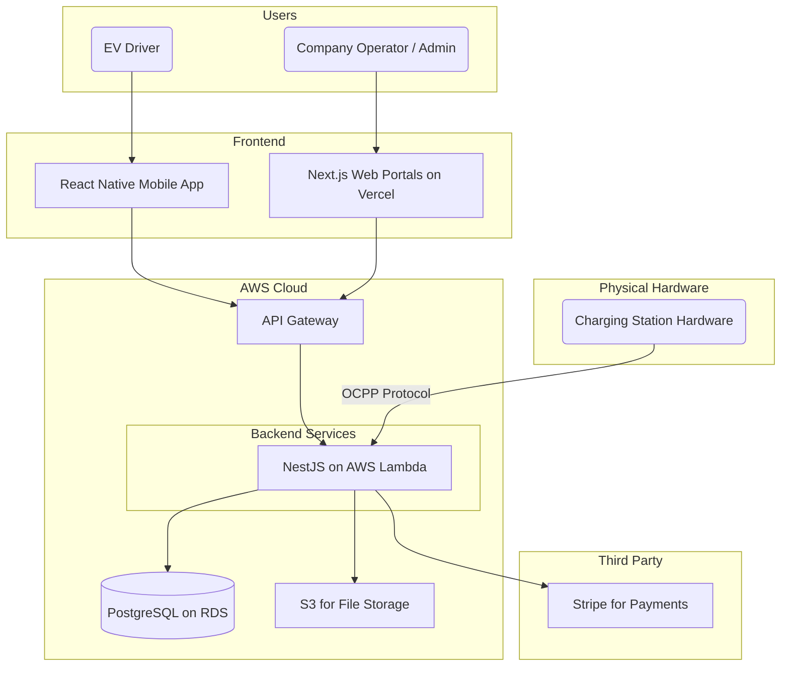

# Charging Station SaaS System - System Overview

## 1. Introduction
本文档概述了"充电站 SaaS 系统"项目的完整全栈架构，包括后端系统、前端实现及其集成方式。它将作为 AI 驱动开发过程中唯一的"事实来源"，确保整个技术栈的一致性。这种统一的方法将传统上独立的后端和前端架构文档合并，以简化现代全栈应用的开发流程，因为在现代应用中，前后端的关联日益紧密。

### Starter Template or Existing Project
* N/A - Greenfield project。
* **说明**: 本项目为全新开发。此架构将根据 PRD 中已确定的技术栈（如 Next.js, NestJS, Chakra UI 等）从零开始设计，不基于任何现有的启动模板。

### Change Log
| Date | Version | Description | Author |
| :--- | :--- | :--- | :--- |
| 2025-08-19 | 1.0 | Initial architecture draft | Winston, Architect |

---

## 2. High Level Architecture

### Technical Summary
This project will be a full-stack, multi-tenant SaaS application built on a TypeScript-based monorepo. The frontend consists of a responsive Next.js web application for our portal users and a React Native application for drivers. The backend is a serverless architecture using NestJS on AWS Lambda, communicating with a PostgreSQL database. The entire system is designed for scalability, security, and a streamlined developer experience.

### Platform and Infrastructure Choice
* **Platform:** A hybrid approach using **Vercel** for the frontend and **Amazon Web Services (AWS)** for the backend.
* **Key Services:**
    * **Vercel:** Hosting for the Next.js web portals, providing CI/CD, global CDN, and serverless function capabilities for the frontend.
    * **AWS:**
        * **Lambda:** For running the serverless backend API.
        * **API Gateway:** To manage and secure API endpoints.
        * **RDS for PostgreSQL:** For a managed, scalable relational database.
        * **S3:** For file storage (e.g., company logos).
        * **Cognito (or similar):** For managing user authentication.
* **Rationale:** This combination offers the best of both worlds: Vercel provides a superior developer experience and performance for the Next.js frontend, while AWS offers a robust, scalable, and secure backend infrastructure that can handle the complex needs of a SaaS application.

### Repository Structure
* **Structure:** **Monorepo**
* **Monorepo Tool:** We will use **Turborepo** to manage the monorepo.
* **Rationale:** A monorepo is ideal for this fullstack project as it will streamline code sharing between the frontend, mobile app, and backend (especially for shared types via the `packages/shared-types` directory), simplify dependency management, and allow for unified tooling (linting, testing, etc.).

### High Level Architecture Diagram

### Architectural Patterns

  * **Jamstack Architecture:** The Next.js web portals will be built following Jamstack principles (pre-rendered frontend, decoupled from backend APIs) for optimal performance and security.
  * **Serverless Architecture:** The backend API will be fully serverless, leveraging AWS Lambda to ensure scalability and cost-efficiency.
  * **API Gateway Pattern:** All frontend clients will communicate with the backend through a single, managed API Gateway. This centralizes concerns like authentication, rate limiting, and request routing.
  * **Repository Pattern:** The backend services will use the repository pattern to abstract data access logic. This decouples business logic from the database, making the application easier to test and maintain.