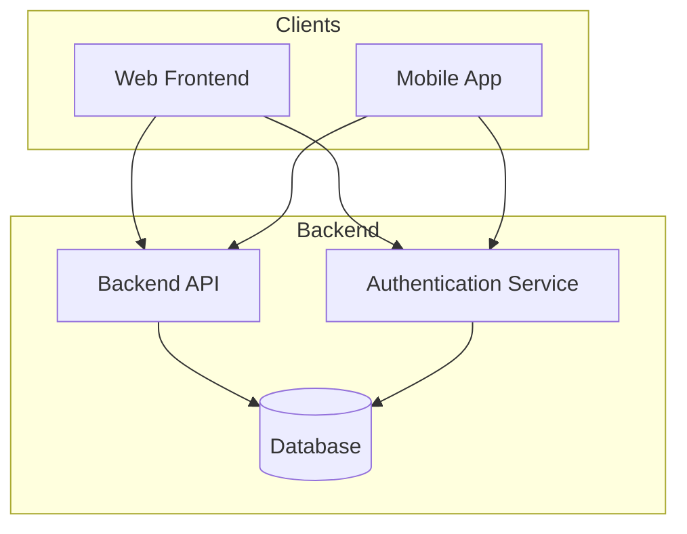
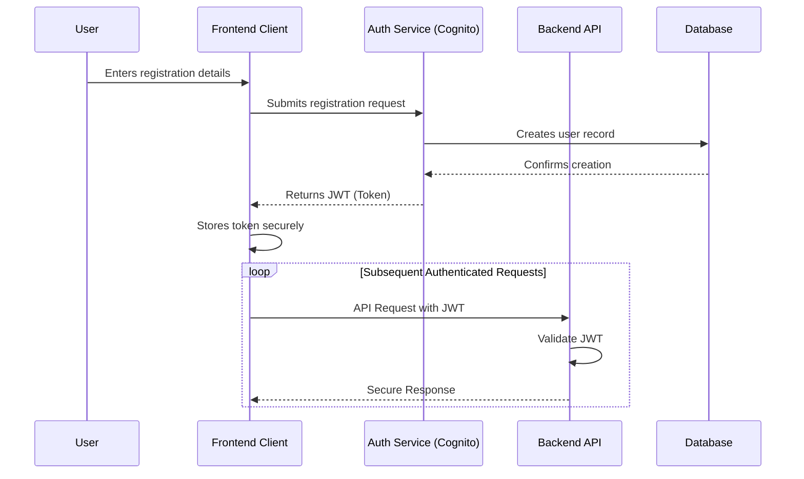
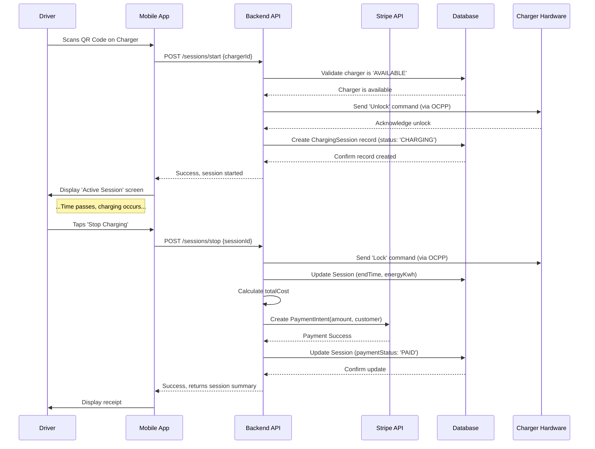

# Components & Core Workflows

## Component List

  * **Web Frontend (Portals)**

      * **Responsibility:** Provides the UI for Platform Admins and Company Operators. Handles user input, renders data from the API, and manages client-side state.
      * **Key Interfaces:** Consumes the REST API.
      * **Dependencies:** Backend API.
      * **Technology Stack:** Next.js, Chakra UI, Zustand.

  * **Mobile App**

      * **Responsibility:** Provides the UI for EV Drivers. Manages the entire charging flow from station discovery to payment.
      * **Key Interfaces:** Consumes the REST API; interacts with device hardware (GPS, Camera).
      * **Dependencies:** Backend API.
      * **Technology Stack:** React Native.

  * **Backend API (Core Services)**

      * **Responsibility:** Handles all business logic, data validation, and orchestration. Exposes the secure REST API for all clients.
      * **Key Interfaces:** Provides the REST API. Consumes the Database and Authentication Service.
      * **Dependencies:** Database, Authentication Service, External APIs (Stripe).
      * **Technology Stack:** NestJS on AWS Lambda.

  * **Authentication Service**

      * **Responsibility:** Manages user identities, sign-up, login, and the issuance of JWTs.
      * **Key Interfaces:** Provides authentication endpoints (e.g., `/login`, `/register`).
      * **Dependencies:** Database (for user records).
      * **Technology Stack:** AWS Cognito.

  * **Database**

      * **Responsibility:** Persists all application data, including users, companies, stations, chargers, and sessions.
      * **Key Interfaces:** SQL interface consumed by the Backend API's data access layer.
      * **Dependencies:** None.
      * **Technology Stack:** PostgreSQL on AWS RDS.

---

## Component Diagrams

This diagram illustrates the primary interactions between the major components.

---

## External APIs

### Stripe API

  * **Purpose:** To securely process payments from EV drivers after charging sessions and to handle the financial records.

  * **Documentation:** Official Stripe API documentation at `https://stripe.com/docs/api`

  * **Base URL(s):** `https://api.stripe.com`

  * **Authentication:** All requests must be authenticated from our secure backend using a secret API key provided in an `Authorization: Bearer <YOUR_SECRET_KEY>` header.

  * **Rate Limits:** The application must gracefully handle potential rate-limiting errors (`429 Too Many Requests`).

  * **Integration Notes:**

      * The frontend clients will use a **publishable key** to tokenize card information directly with Stripe, ensuring sensitive card details never touch our servers.
      * Our backend will receive this token to create customers and charge them.
      * We will need to configure webhooks to receive asynchronous events from Stripe, such as charge failures or disputes.

  * **Key Endpoints Used:**

      * `POST /v1/customers`: To create a Stripe Customer object for each EV driver when they add their first payment method.
      * `POST /v1/payment_methods`: To create and attach a new payment method to a Customer.
      * `POST /v1/payment_intents`: To create, confirm, and process a payment after a charging session is completed.

---

## Core Workflows

### User Registration & Login Flow

This diagram shows the sequence for a new EV driver registering and authenticating with the system.

---

### Charging Session Lifecycle Flow

This diagram illustrates the end-to-end process of a driver starting and stopping a charging session.

