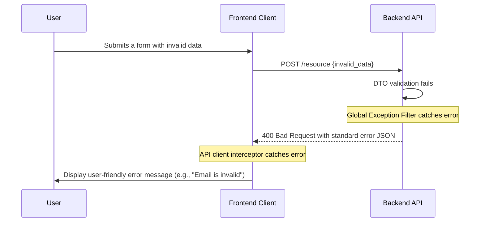

# Coding Standards & Monitoring

## Coding Standards

### Critical Fullstack Rules

1.  **Type Sharing:** All shared data structures (e.g., `User`, `Station`) MUST be imported from the `packages/shared-types` package. Never redefine types within an application (`apps/web`, `apps/api`, etc.).
2.  **Environment Variables:** Environment variables MUST be accessed through a dedicated, validated config service. Never use `process.env` directly in business logic or components.
3.  **API Communication:** The frontend clients MUST use the centralized API client (`/lib/api.ts`) for all backend requests. Do not use `fetch` or `axios` directly in components.
4.  **Database Access:** All database queries in the backend MUST go through a designated Repository class. Never use the TypeORM entity manager directly from a Service class.
5.  **Error Handling:** All API controller methods MUST use the standard global error handling filter. Do not use generic `try/catch` blocks to send HTTP error responses.

---

### Naming Conventions

| Element | Frontend | Backend | Example |
| :--- | :--- | :--- | :--- |
| Components | PascalCase | - | `UserProfile.tsx` |
| Hooks | camelCase with 'use' | - | `useAuth.ts` |
| API Routes | - | kebab-case | `/api/user-profile` |
| Database Tables | - | snake\_case | `user_profiles` |

---

## Error Handling Strategy

### Error Flow

This diagram shows how a typical validation error flows from the backend to the user.



---

### Error Response Format

All errors returned by the API will follow this standardized JSON structure.

```typescript
interface ApiError {
  error: {
    code: string;       // e.g., 'VALIDATION_ERROR'
    message: string;    // User-friendly summary
    details?: Record<string, any>; // Field-specific errors
    timestamp: string;
    requestId: string;
  };
}
```

---

### Frontend Error Handling

The central API client will have an interceptor to handle these standardized errors.

```typescript
// In /lib/api.ts (continued)
apiClient.interceptors.response.use(
  (response) => response,
  (error) => {
    const apiError = error.response?.data?.error;
    if (apiError) {
      // Show a toast notification with apiError.message
      console.error(apiError); 
    } else {
      // Handle network errors or non-standard errors
      console.error('An unexpected error occurred:', error.message);
    }
    return Promise.reject(error);
  }
);
```

---

### Backend Error Handling

A global `ExceptionFilter` in NestJS will catch all unhandled exceptions and format them into our standard error response.

```typescript
// In /filters/http-exception.filter.ts
import { ExceptionFilter, Catch, ArgumentsHost, HttpException } from '@nestjs/common';
import { Request, Response } from 'express';

@Catch()
export class AllExceptionsFilter implements ExceptionFilter {
  catch(exception: unknown, host: ArgumentsHost) {
    const ctx = host.switchToHttp();
    const response = ctx.getResponse<Response>();
    const request = ctx.getRequest<Request>();
    
    // Determine status code and message
    const status = exception instanceof HttpException ? exception.getStatus() : 500;
    const message = exception instanceof HttpException ? exception.message : 'Internal Server Error';

    response.status(status).json({
      error: {
        code: exception.constructor.name.toUpperCase(),
        message: message,
        timestamp: new Date().toISOString(),
        requestId: request.headers['x-request-id'], // Assuming a request ID middleware
      },
    });
  }
}
```

---

## Monitoring and Observability

### Monitoring Stack

  * **Frontend Monitoring:** **Vercel Analytics**. This is built into our deployment platform and will provide Core Web Vitals and real-time traffic insights out of the box.
  * **Backend Monitoring:** **AWS CloudWatch**. This is the native solution for our AWS backend, automatically collecting logs, metrics (invocations, errors, duration), and enabling alarms for our Lambda functions and RDS database.
  * **Error Tracking:** **Sentry**. We will integrate the Sentry SDK into both the frontend and backend to provide aggregated error reporting, stack traces, and alerts for uncaught exceptions.
  * **Performance Monitoring:** **AWS X-Ray**. We will enable X-Ray for our backend to trace requests as they travel from the API Gateway through our Lambda services to the database, helping us pinpoint performance bottlenecks.

---

### Key Metrics

  * **Frontend Metrics:**

      * Core Web Vitals (LCP, INP, CLS)
      * JavaScript error rate
      * API latency from the client's perspective
      * User interaction funnels (e.g., session start to session complete)

  * **Backend Metrics:**

      * API Gateway request rate and error rate (4xx, 5xx)
      * Lambda function invocation count, error rate, and duration
      * Database connection count and query latency (from RDS Performance Insights)